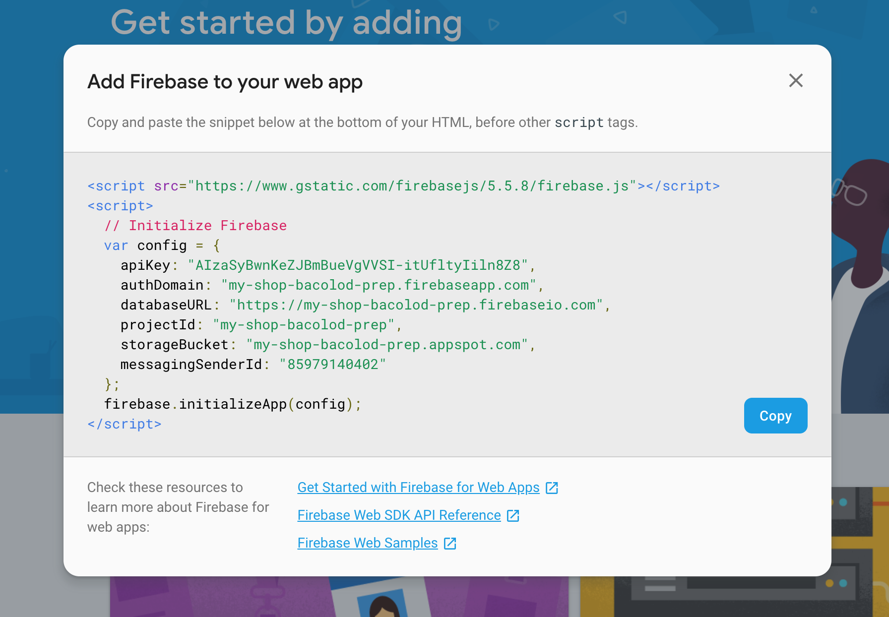
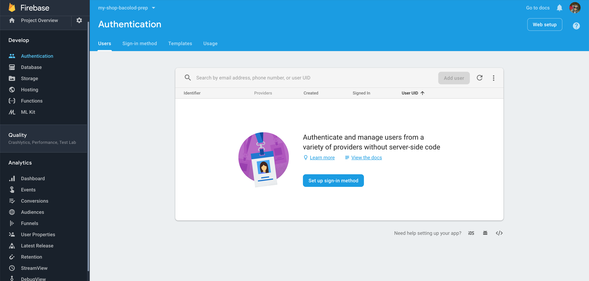

# Setup to Authenticate

1. Create a firebase project
    * go to https://console.firebase.google.com/u/0/
2. Install and setup firebase tools
    * install npm https://www.npmjs.com/get-npm
    * install firebase tools using the command `npm install -g firebase-tools`
    * login using the command `firebase login`
3. Initialize the firebase project
    * Intialize a project using the command `firebase init`
    * run local server `firebase serve`
4. Setup firebase to be available in your code
    * copy the config
    
5. Setup Authentication
    
